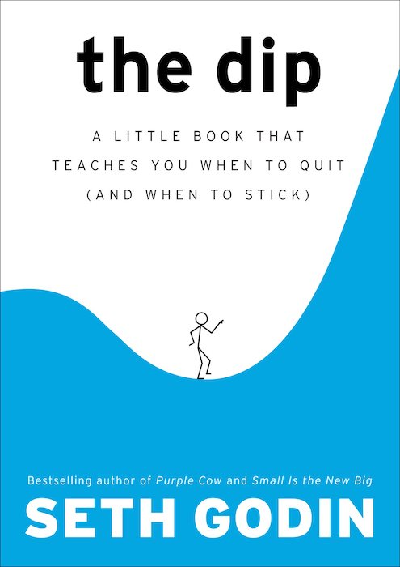
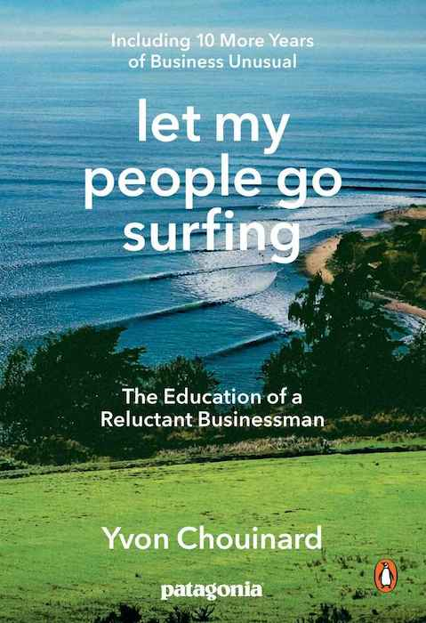
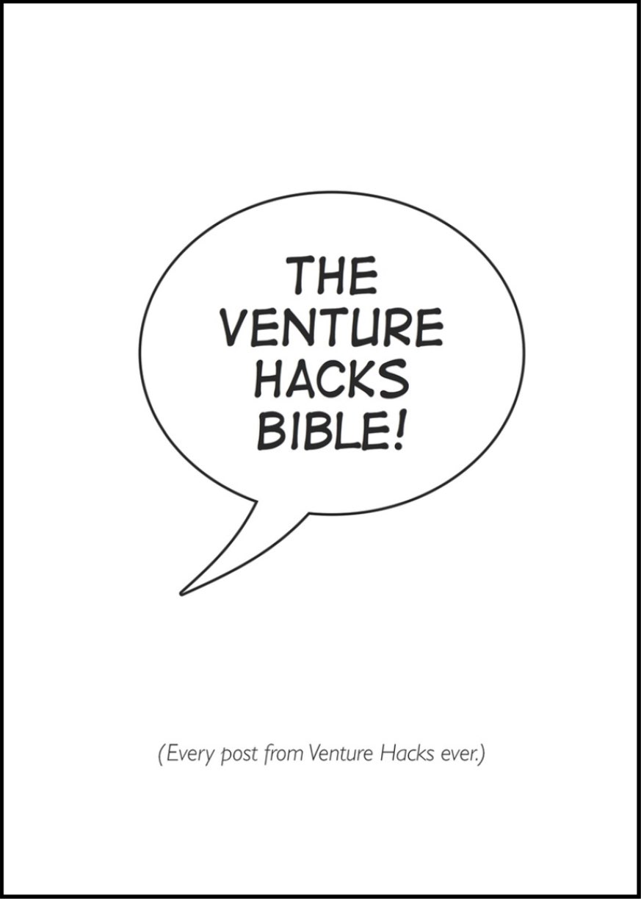
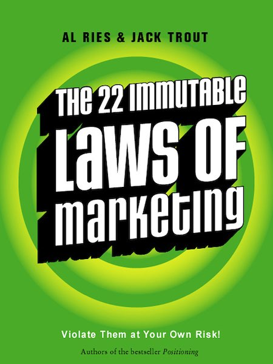
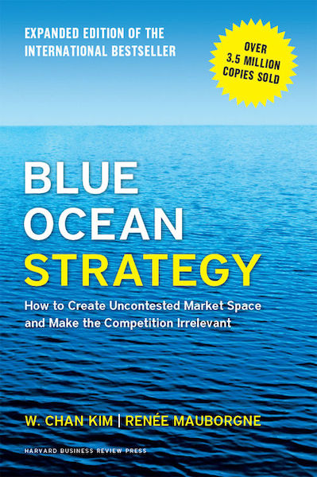

What follows is a compilation of some of our favorite business books you should probably be reading as a startup founder.

This list includes titles that usually fly under the radar as far as book recommendations go. It was tough to settle on just a few among so many great books out there but here it is. Without further ado...

## 1. The dip

<figcaption>The Dip by Seth Godin</figcaption>

Seth Godin – in his infinite business wisdom – describes the long, painful stage that every project worth tackling goes through, which he calls "the dip".

In this super short read, Seth conveys a simple but powerful message about when to quit and when not to. He makes various inspiring points about staying motivated by not losing sight of the light at the end of the tunnel. He also warns us about recognizing that sometimes the best strategy is quitting and pursuing other more promising projects.

The Dip is especially useful if you find yourself going through a tough period with few results to speak of. You can easily finish this book in one sitting, very well worth the read!

## 2. Let my people go surfing

<figcaption>Let My People Go Surfing by Yvon Chouinard</figcaption>

Written by one of the most unconventional entrepreneurs out there, [Yvon Chouinard](https://en.wikipedia.org/wiki/Yvon_Chouinard) takes us on a full tour for the inner workings of Patagonia, one of the most inspiring brands out there.

This book works as a business manual which is just as informative as it is inspiring. It describes not just the many aspects of their various operations – including marketing, finance, human resources and more – but more importantly, their radical business philosophy that defies traditional canons. Absolute must-read.

## 3. Venture hacks bible

<figcaption>Venture Hacks Bible by Naval Ravikant</figcaption>

If you plan on raising funds then this [e-book](https://leanpub.com/venturehacks) should be at the very top of your pile. This compilation of all the blog posts from Naval's [Venture Hacks blog](https://venturehacks.com/) is a serious staple of startup knowledge.

The basic premise is that as a founder, you might negotiate a few deals over the years, whereas VCs negotiate many deals a year, putting you at a clear negotiating disadvantage. This book is one of the best attempts out there at leveling this perilous information asymmetry.

Naval walks us through a ton super actionable points that are very useful when negotiating the most important deal you might have to make on behalf of yourself, your co-founders and your company. Skip this one at your own peril.

## 4. The 22 Immutable Laws of Marketing

<figcaption>The 22 Immutable Laws of Marketing by Al Ries & Jack Trout</figcaption>

As a technologist, one of the most refreshing aspects of marketing as a discipline is that – unlike technology – human psychology doesn't change that much. This fact makes the core principles of marketing pretty much immutable. Hence this great little book.

Co-written by [Jack Trout](https://en.wikipedia.org/wiki/Jack_Trout) and [Al Ries](https://en.wikipedia.org/wiki/Al_Ries), two of the pioneers of marketing positioning, this book takes us on a very entertaining tour of twenty-two timeless principles of how marketing works in the wild. While still keeping it short-and-sweet, the authors teach us the main concepts one should keep top of mind when designing marketing strategies.

This is not an industry-specific book. It's also not very detailed. And that's exactly why it works so well. Give this one a try, you can't go wrong with it!

## 5. Blue ocean strategy

<figcaption>Blue ocean strategy by W. Chan Kim & Renée A. Mauborgne</figcaption>

This book is a no-nonsense read about avoiding what the authors call "red oceans" – the kind where competition is fiercest – and creating uncontested "blue oceans" where you get to own a market category of your own creation.

Published by Harvard Business School, this is the most academic book of all the ones in this list and probably the most detailed as well, which is why we left it for last. Still, it's a fun read that doesn't get too stuffy despite its academic nature.

Absolutely worth the read, be sure to check this one out.
