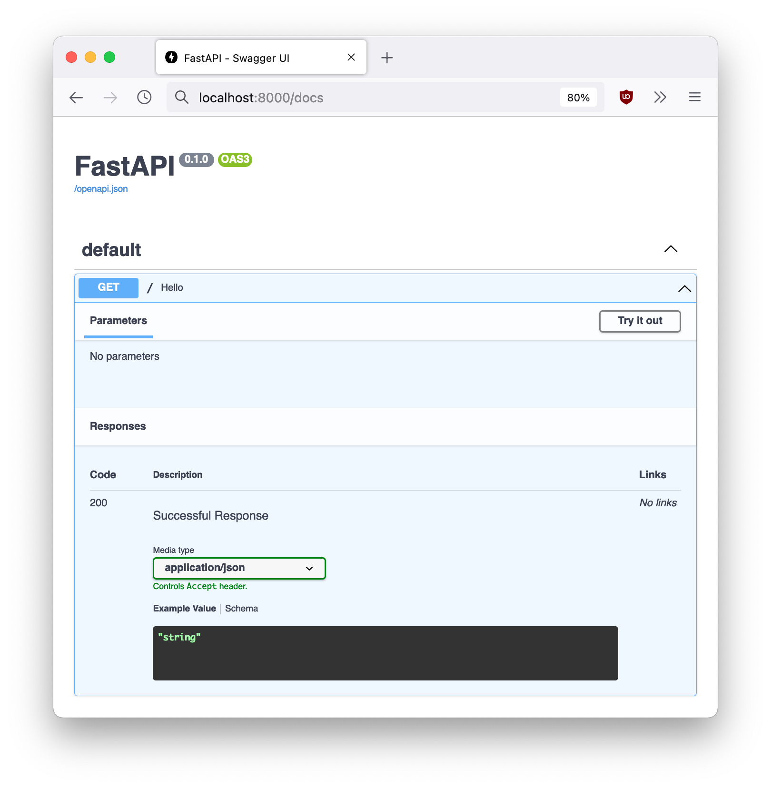

Python is such a great fit for powering all kinds of applications. We write Python for things like orchestrating gaming infrastructure, transcoding media, posting blockchain transactions, test automation and more.

With such a wide range of applications it's pretty natural to ask: what is the optimal way to deploy Python apps?

We devote a lot of brain cycles to architecting our tools for delivering world-class apps. What follows is a walkthrough of our own Python service architecture so you can leverage the same principles in your products to make them awesome. ✨

## TL,DR

Wanna get coding right away? We open sourced an internal project called [Narwhal](https://github.com/ApsisTechnologies/narwhal) which implements all of the features described below.

It also comes with utility commands and a few other goodies you can use to bootstrap your projects.

### Narwhal Quick Setup

```bash
$ git clone https://github.com/ApsisTechnologies/narwhal.git
$ cd narwhal
$ make dev
Running app locally with hot reload on http://localhost:8000...
INFO:     Will watch for changes in these directories: ['/Users/martin/Development/projects/apsis/narwhal']
INFO:     Uvicorn running on http://0.0.0.0:8000 (Press CTRL+C to quit)
INFO:     Started reloader process [82688] using watchgod
INFO:     Started server process [82697]
INFO:     Waiting for application startup.
INFO:     Application startup complete.
```

And voilà! You're up and running. 🚀

## Now onto the deets!

Before we delve into the details, let's discuss the main goals when architecting our services:

- **Speed**: We want every bit of performance we can squeeze out of our code. Snappy services make for happy users.
- **Safety**: Secure code is a must. User data needs to be secure at all times, no excuses.
- **Ease of deployment**: We want to deliver software as fast and as painlessly as possible without compromising on [developer experience](https://future.a16z.com/the-case-for-developer-experience/).

Which brings us to...

### FastAPI for the win

We're big fans of [FastAPI](https://fastapi.tiangolo.com/uk/deployment/server-workers/). FastAPI is at the heart of how we deliver our services.

In case you haven't yet heard of it, FastAPI is an [ASGI](https://asgi.readthedocs.io/en/latest/) server framework. It provides OpenAPI documentation out of the box as well as type checking. It uses [uvicorn](https://www.uvicorn.org/) as its server gateway interface (which uses [uvloop](https://github.com/MagicStack/uvloop)), providing ultra-fast response times for your Python APIs, on par with Node.js.

Here's all the Python code you'll need:

```python
# src/main.py

from fastapi import FastAPI

app = FastAPI(title="FastAPI")

@app.get("/")
async def hello():
  return {"Hello": "FastAPI!"}
```

### Dependency management

We'll be using [Poetry](https://python-poetry.org/docs/) to manage our Python dependencies which also simplifies working with virtual environments. Poetry is to Python what `yarn` or `npm` are to Node.js. Suffice to say Poetry is miles ahead of good ol' `pip`, so make sure you [install Poetry](https://python-poetry.org/docs/#installation) before proceeding.

We start by writing a `pyproject.toml` for our project configuration:

```toml
[tool.poetry]
name = "my-fastapi-app"
description = "My FastAPI service!"

[tool.poetry.dependencies]
python = "^3.9"
fastapi = "^0.70.0"
uvicorn = {extras = ["standard"], version = "^0.16.0"}

[build-system]
requires = ["poetry-core>=1.0.0"]
build-backend = "poetry.core.masonry.api"
```

With this in place, just type:

```bash
$ poetry install
$ poetry run uvicorn src.main:app \
		--loop uvloop \
		--host 0.0.0.0 \
		--port 8000 \
		--reload
```
 You should now have your basic app running in development mode. The `--reload` flag enables hot reloading so you can modify your code on the fly and see the changes live. Just `curl` your local url to see it in action:

```bash
$ curl http://localhost:8000
{"Hello":"FastAPI!"}
```

You can also navigate to `http://localhost:8000/docs` to see the OpenAPI documentation that FastAPI generates for you out of the box:

<figcaption>Automatically-generated OpenAPI documentation. How cool is that?</figcaption>

### Putting it all together

Let's write a Dockerfile to tie it all together. We'll be using a [multi-stage Docker build](https://docs.docker.com/develop/develop-images/multistage-build/) to keep our final container image as lightweight as possible. The first build phase below called `builder-image` is in charge of installing Poetry as well as installing and compiling all of our FastAPI app dependencies:


```Dockerfile
# builder image
FROM python:3.9-alpine AS builder-image

RUN apk update && \
    apk add \
      curl \
      make \
      g++

# install Poetry
RUN curl -sSL https://raw.githubusercontent.com/python-poetry/poetry/master/get-poetry.py | python -

ADD poetry.lock .
ADD pyproject.toml .

RUN poetry install --no-dev

# app image
FROM python:3.9-alpine AS app-image-base

ENV PYTHONDONTWRITEBYTECODE 1
ENV PYTHONBUFFERED 1

WORKDIR /opt/app

# copy virtual environment as is
COPY --from=builder-image /opt/app/.venv .venv
ADD ./src .
ADD ./entrypoint.sh .
RUN chmod +x entrypoint.sh

# switch to non-root user
RUN addgroup -S app && adduser -D -G app app
USER app

ENTRYPOINT /opt/app/entrypoint.sh $0 $@

CMD ["uvicorn", "main:app", "--proxy-headers", "--loop uvloop", "--workers 1", "--host 0.0.0.0", "--port 8000"]
```

There's a lot going on here, let's break it down. First, we base our app image on [Alpine Linux](https://www.alpinelinux.org/) to keep our containers light. Alpine's base image with the Python runtime is ~45MiB, with our final app being at around ~72MiB!

Also, since we don't want to keep intermediate build artifacts in our final app image (derived from compiling uvloop), we'll create a base build stage called `app-image-base` and copy the resulting virtual environment with all our dependencies into it. This leave us with a clean Python app and all its dependencies.

### Seatbelts please!

Most Linux containers in the wild are run as `root` which is ill-advised to put it mildly. In order to avoid any [privilege escalation](https://en.wikipedia.org/wiki/Privilege_escalation) hazards, we create a new, non-root user called `app` to run our application and switch to it by default.

Finally, we add an `entrypoint.sh` helper script which receives the app's command line arguments to run our FastAPI server for us when the container starts:

```bash
#!/bin/sh
set -e
# let's activate our virtual environment
. /opt/app/.venv/bin/activate
exec "$@"
```

All that's left at this point is to build our container image and run it:

```bash
$ docker build -tag my-fast-api-app .
$ docker run -it --rm -p 8000:8000 my-fast-api-app

Running app container on http://localhost:8000
```
### Summary

That's it! We got our FastAPI server running in no time. You should now have a solid foundation to deploy lightning-fast, secure Python APIs onto your favorite infrastructure provider.

Enjoy! 🥳
