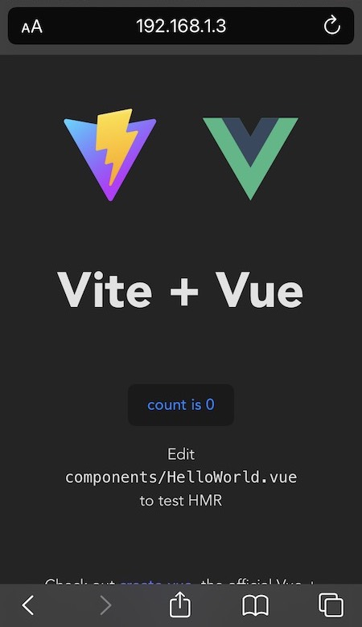

The big promise of web technologies has always been that web content would behave exactly the same everywhere. Sadly, this is not always the case in the real world (I'm looking at you Safari...), forcing you to dig a bit deeper to fix any issues.

This is somewhat to be expected if you consider the fact that modern browsers are approaching the technological complexity of full-fledged operating systems (heck, they might even surpass them, only time will tell).

That’s why it’s so key to test your web applications on the widest possible range of devices and situations to make sure they look and behave as expected.

This tutorial will teach you how to setup a simple web app and debug it on both iOS Safari and Chrome for Android.

## What you’ll need to get started

First let’s make sure you have the following:

- A Mac computer (a must if you want to debug web apps on iOS).
- Google Chrome installed.
- `npm` installed on your computer.
- An iOS device.
- An Android device.

> If you only care about Android then this tutorial should work on Linux and Windows as well.

Next, make sure your devices are connected to your computer over USB so that your browser’s dev tools can detect and connect to your mobile browsers.

> Note: Follow [these instructions](https://developer.android.com/studio/debug/dev-options#enable) to enable USB debugging on Android.

Finally make sure that your computer and mobile devices are all connected to the same wifi network.

## Setting up your development environment

Now let’s create a template project that can be served on your local computer. For this we’re going to use [Vite](https://vitejs.dev/). Vite is not mandatory for this tutorial but it greatly simplifies setting up our dev server.

> In case you’re not familiar, Vite is a modern web development framework that’s leaps and bounds ahead of legacy build tools like Webpack or Rollup. Vite speeds up web development by an insane amount. By leveraging browser-native ES modules, Vite bypasses the need to rebuild your entire project's dependency tree every time you make a change in your code.

To create our template project open up your terminal and run `npm create vite@latest` and when prompted, give your project a name like `mobile-debug` and then select whatever framework you feel comfortable with. Our choice is Vue + Typescript.

```
$ npm create vite@latest

✔ Project name: mobile-debug
✔ Select a framework: › Vue
✔ Select a variant: › TypeScript

Scaffolding project in /Users/martin/projects/mobile-debug...

Done. Now run:

  cd mobile-debug
  npm install
  npm run dev
```

Next, change into the project's directory and install the project's dependencies:

```
$ cd mobile-debug
$ npm install
```

Now open up your project's `package.json` file using your favorite text editor and change the `"dev"` script to `"vite --host=0.0.0.0 --port=3000"`.

This will make the dev server bind to your local computer's network interface so your mobile devices can access your web application over your local network. Here we choose port `3000` but you can choose whatever port you like.

Your `package.json` should look more or less like this:

```
{
  "name": "mobile-debug",
  "private": true,
  "version": "0.0.0",
  "type": "module",
  "scripts": {
    "dev": "vite --host=0.0.0.0 --port=3000",
    "build": "vue-tsc --noEmit && vite build",
    "preview": "vite preview"
  },
  "dependencies": {
    "vue": "^3.2.37"
  },
  "devDependencies": {
    "@vitejs/plugin-vue": "^3.1.0",
    "typescript": "^4.6.4",
    "vite": "^3.1.0",
    "vue-tsc": "^0.40.4"
  }
}
```
## Starting your development server

Now run `npm run dev` to spin up your development server:

```
$ npm run dev
  VITE v3.1.8  ready in 586 ms

  ➜  Local:   http://localhost:3000/
  ➜  Network: http://192.168.1.3:3000/
```

<figcaption>Notice how long it took to spin up our dev server? 586ms! 🤯</figcaption>

Now copy and paste the url `http://192.168.1.3:3000/` on your browser. You should now have your template app running on your local machine:


> Note: If this is your first time running a Node.js server locally, then you'll likely see a little popup asking you to allow incoming connections for Node.js:
> 
> macOS' firewall blocks traffic based on applications instead of ports. Clicking "allow" will add a rule to macOS's firewall to allow incoming network traffic into your local Node.js web server, which is exactly what we need:
> 

## iOS setup

On your iOS device, open up Safari and type the local IP and port you got from the dev server (in our case `192.168.1.3:3000`). You should be able to see the web app rendered on your device:



Next, make sure your iOS device is connected to your computer over USB and open up Safari desktop. You'll have to enable the developer menu before you can proceed. Open up Safari settings via Safari's top menu: `Safari` menu > `Preferences` (or press `Cmd + ,`). Go to the "Advanced" tab and toggle the checkbox that says "Show develop menu in menu bar".


This will add an extra menu to Safari where you can see your connected iOS device listed (in our case "Ananda iPhone"). Inside that menu you should also be able to see all your open tabs listed. Select the one with the IP from your dev server (in our case `192.168.1.3`):


And voilà! The Safari developer tools should open up, allowing you to fully debug your web app on mobile Safari. From this point on you can inspect your HTML and CSS, set breakpoints or whatever else you need:

<figcaption>Safari developer tools</figcaption>

## Android setup

Now onto Android mobile. First, make sure your Android device is connected to your computer over USB and you enabled developer mode and USB debugging.

Open up Google Chrome on your Android device and type the local IP and port you got from the dev server (again, `192.168.1.3:3000` in our case). Our web app should render:


Next, go to your computer, open up a new tab on Google Chrome and type `chrome://inspect/#devices` in the address bar. Assuming USB debugging is enabled and your Android device is unlocked you should see a list of all the devices Google Chrome detected on your network. In our case we can see a Google Pixel 4a phone, along with all the open tabs inside Chrome for Android, including our dev server:


Click "inspect" on it as shown above. Google Chrome's developer tools should pop up, allowing you to fully debug your web app running on your Android device:

<figcaption>Google Chrome developer tools</figcaption>

## Summary

In this tutorial we showed you how easy it is to fully debug a web application on both iOS and Android devices so you can make sure they are rock-solid before you launch.

Happy coding! 🚀
