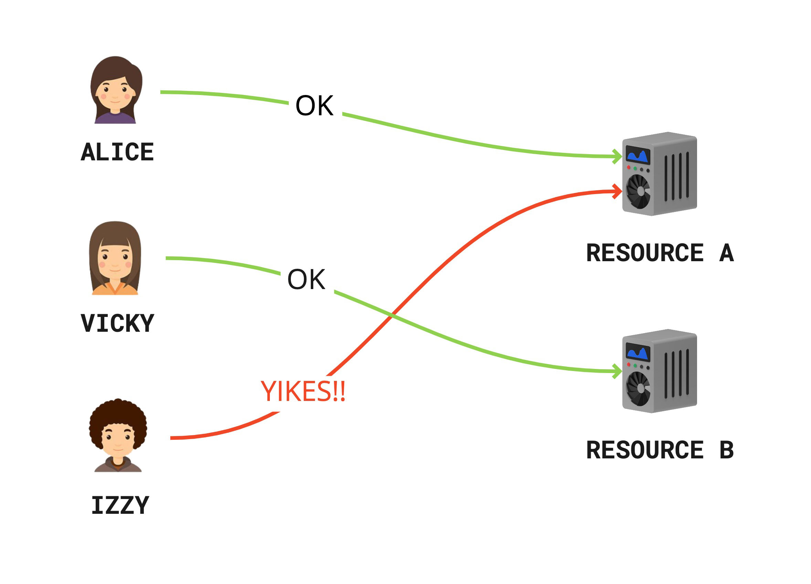
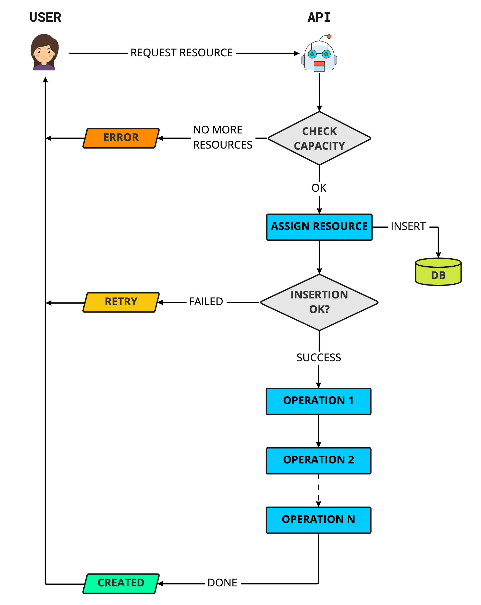

When it comes to distributed computing, making sure that resources are properly and safely allocated is a central topic. In this blog post we'll explore a very effective way to implement transactionality in a distributed environment like the cloud.

This design pattern is particularly useful in the context of serverless architectures where more costly methods of implementing transactionality are impractical due to how short-lived operations tend to be in this context *.

We use this design extensively for provisioning gaming infrastructure in an automated fashion, where each player can run a game on a dedicated instance.

> (*) Some architectural patterns exist to help deal with this kind of problem (e.g. the [Saga pattern](https://docs.aws.amazon.com/prescriptive-guidance/latest/modernization-data-persistence/saga-pattern.html)) but they are not straightforward to implement. They typically involve undoing failed/aborted operations, which increases system complexity, API latency and cloud costs.

## The problem

Imagine a scenario where users of a system, potentially in the millions, concurrently request a resource from a pool of pre-existing resources (say, from a cluster of dedicated compute instances).

For each user request we need to make sure that:

1. If there are no more available resources, return an `out of resources` error.
1. If a given user already holds a resource, return the existing resource.
1. No two users can be assigned the same resource (i.e. avoid race conditions).

We can solve (1) by checking resource capacity and responding accordingly. (2) is also trivial to solve by just keeping track of resource ownership and returning the already assigned resource (more on that later).

That leaves us with the more interesting problem of avoiding data races. The problem would look something like this:

<figcaption>Ouch! Alice and Izzy both got the same resource. 🙈</figcaption>

...or its meme equivalent:

<figcaption>Distributed problems... 🙄</figcaption>

## Transactionality to the rescue

Transactionality in a non-distributed context (say, in a desktop/mobile app) is pretty straightforward to solve. We just serialize resource access using  synchronization primitives like [mutexes](https://en.wikipedia.org/wiki/Lock_(computer_science)), [semaphores](https://en.wikipedia.org/wiki/Semaphore_(programming)), etc.

But when it comes to a massively distributed context like the cloud, serializing such operations is harder. There's usually no overarching operating system we can rely on to monitor the execution of operations to guarantee our system's integrity. We could serialize requests using a queue but that would make our API calls asynchronous.

We wanted to find a reliable, synchronous mechanism to ensure that all operations are properly serialized to avoid data races.

## Solution time!

There are two main aspects to our solution. We need to:

1. Use some sort of data structure to keep track of resource ownership.
2. Make sure that assigning a resource to a user happens transactionally to avoid data races.

So for (1), what data structure should we pick? Sounds like a database table would be a great fit. A table could use the resource's unique identifier as primary key, with each record holding a reference to the user that owns the resource (say, the user id).

And for (2) we can use the fact that insertions in a database table are usually consistent. If we were to insert a record with the same primary key (in our case the resource identifier) more than once we would get an error saying that we violated the primary key uniqueness constraint.

So our solution could work like this:

1. Create a table with resource id as primary key*.
2. When a user is assigned a (seemingly) available resource, insert a record in our resource table.
3. ✅ If the insertion succeeds, the user now owns the resource and we can proceed with any other (potentially lengthy) operations without fear of race conditions.
4. 🚫 If the insertion fails, then we just ask the caller to retry the request, without needing to undo any operations.

> (*) We should probably also create a table index to be able to query our table by `user_id`, we're just glossing over that bit here to keep things simple.

Here's how our algorithm would look like:

Pretty simple huh?

This pattern resembles a distributed critical section. Only that instead of using an operating system-provided synchronization primitive, we just simulate one using a database insertion operation.

Note that all operations happening after a successful record insertion can be owned exclusively by the caller without worrying about race conditions.

## Client side considerations

If we also control the client-side implementation, as it's often the case, we can simplify client code by abstracting away the retry logic from the caller. Client code could just transparently retry the request operation in the case of a `RETRY` error.

## Conclusion

Given the ongoing hot trend of pushing local computing onto the cloud, more and more apps and games are being run remotely, so it's pretty easy to picture a wide range of similar applications benefiting from this architecture pattern.

Now go build some awesome products!
